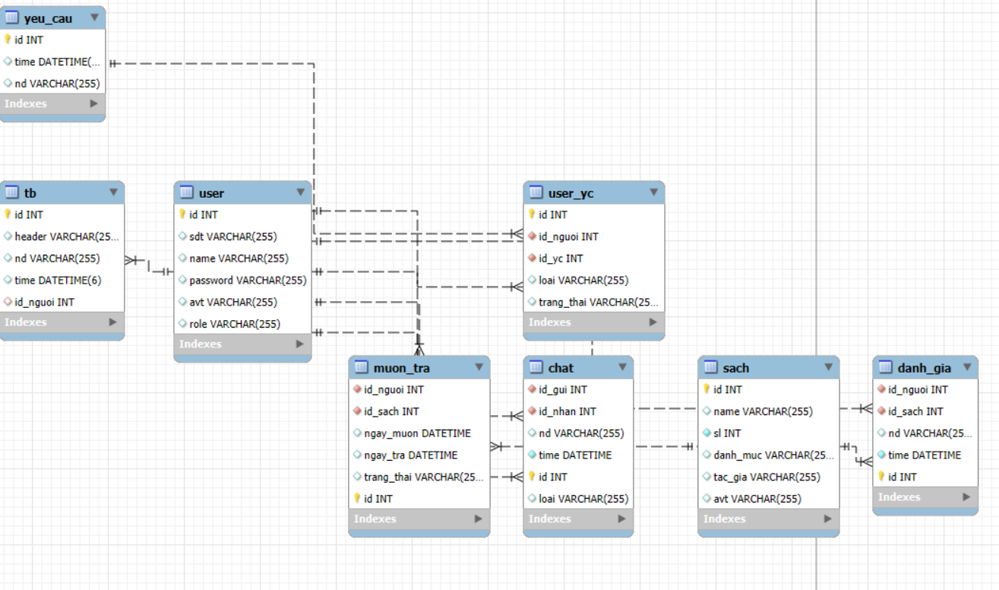

- Thư mục sc dùng để chạy be (springboot), thư mục my-app dùng để chạy fe (reactjs)
- Hệ thống quản lý thư viện với user gồm 3 quyền: admin, thu_thu và sinh_vien
- Khi chạy hệ thống giao diện login sẽ hiện ra với tên đăng nhập là sdt và password (tất cả user trong csdl đều có password là 12345) và với 1 giao diện đăng ký nếu chưa có tài khoản. Mỗi user đăng ký sẽ có quyền là sinh_vien
- Khi đăng nhập thành công thì nó sẽ chuyển đến các trang phù hợp với các role (đều chuyển đến các trang profile theo các role)
- Click vào ảnh avt ở trên góc phải thì sẽ hiển thị ra các lựa chọn như hồ sơ và đăng xuất (nếu bạn là role thu_thu thì còn có thêm 1 lựa chọn là chuyển sang trang có role là sinh_vien nếu ở trang có role là thu_thu và ngược lại), nếu ấn thêm 1 lần nữa thì các lựa chọn ấy sẽ mất
- Trong trang của role sinh_vien còn có thêm 1 icon thông báo cạnh bên ảnh avt ở góc phải màn hình có chức năng là xem các thông báo được admin và thu_thu gửi đến. Nếu nhấp vào 1 trong các thông báo thì nó sẽ hiển ra chi tiết thông báo đã nhấp
- Trong trang của role admin, khi click vào "duyệt đơn làm thủ thư" ở thành header thì nó sẽ chuyển đến trang để duyệt các đơn xin làm thủ thư của sinh viên. Nếu admin đã đồng ý hoặc từ chối yêu cầu ấy thì hệ thống sẽ tự động gửi 1 thông báo đến sinh viên ấy. Còn các chức năng hác của header thì không có gì
- Trong trang của role là thu_thu:
    + Khi click vào "duyệt yêu cầu" trên thanh tiêu đề thì hệ thống sẽ chuyển đến trang duyệt các yêu cầu mượn sách của sinh viên. Nếu thủ thư đồng ý hoặc từ chối, hệ thống sẽ tự động thông báo đến sinh viên.
    + Khi click vào "gửi thông báo" trên thanh tiêu đề thì hệ thống sẽ chuyển đến trang gửi thông báo đến sinh viên theo id. Nếu thành công, hệ thống sẽ tự động gửi thông báo đến sinh viên
    + Khi click vào "xử lí sách" trên thanh tiêu đề thì hệ thống sẽ chuyển đến trang xử lí sách. Trong trang này có 1 thanh menu ở bên trái với các chức năng là tìm kiếm, thêm, sửa & xóa sách. Bên phải là hiển thị các thông tin theo như chức năng đã chọn.
    + Và thủ thư hoàn toàn có thể sử dụng các chức năng của sinh viên khi click vào "chuyển sang sinh viên" trong thanh menu khi click vào avt góc trên bên phải của trang
- Trong trang của role là sinh_vien:
    + Khi click vào "mượn sách" trên thanh tiêu đề thì hệ thống sẽ chuyển đến trang mượn sách của sinh viên. Giao diện sẽ hiện lên với 1 thanh tìm kiếm và tất cả số sách trong thư viện. Khi click vào 1 quyển sách, giao diện của cuốn sách đấy sẽ hiện lên với các thông tin của quyển sách và tất cả bình luận mà sinh viên đã bình luận cho cuốn sách. Nếu sinh viên muốn mượn thì click vào nút mượn sách của trang, nếu sinh viên muốn trả thì click vào nút trả sách của trang
    + Khi click vào "trả sách" trên thanh tiêu đề thì hệ thống sẽ chuyển đến trang xem lịch sử mượn sách của sinh viên đấy.
    + Khi click vào "làm thủ thư" trên thanh tiêu đề thì hệ thống sẽ chuyển đến trang xin làm thủ thư của sinh viên. Khi sinh viên click vào nút xin làm thủ thư thì hệ thống sẽ tự động thêm 1 yêu cầu để duyệt cho thủ thư (nếu user có role là thu_thu thì chức năng này không có trên thanh tiêu đề)
    + Khi click vào "Chat" trên thanh tiêu đề thì hệ thống sẽ chuyển đến trang chat giữa các sinh viên. Trang này sẽ có các chức năng cơ bản như 1 ứng dụng nhắn tin thông thường (dấu + ở phần gửi tin nhắn dùng để chọn file ảnh trên máy và gửi file)
- Các chức năng như chat, bình luận, gửi nhận thông báo đều dùng web socket
- Lược đồ E-R:
    
- Lưu ý: Khi up file lên trên project thì hãy đổi giá trị của UPLOAD_DIR trong class Admin, ThuThu và SinhVien trong package controller trong be thành đường dẫn đến thư mục "my-app/public/images/" được lưu ở trên máy bằng đường dẫn tuyệt đối